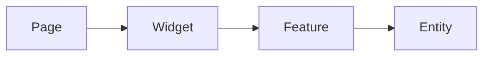
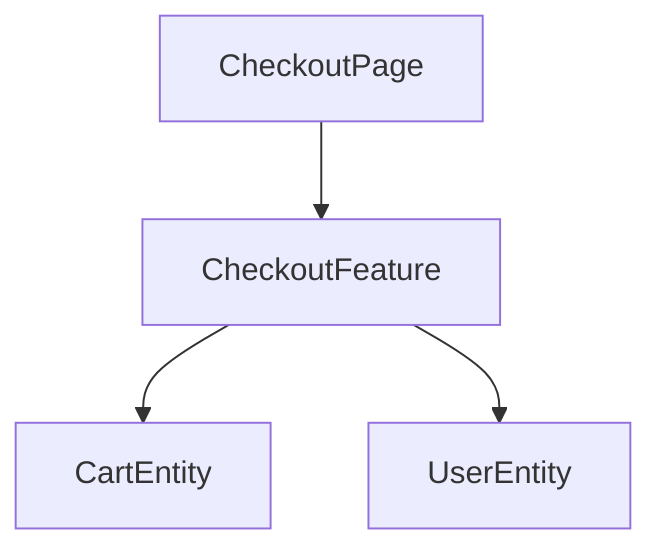

# /project diagram

Generate a Mermaid architecture diagram representing the project's functional structure.

The diagram is a **developer navigation tool** — it answers:
- "Where does new code belong?"
- "Which domain owns this logic?"
- "How do major parts interact?"

## What to Include

- Pages/Screens
- Features
- Widgets (if architecturally relevant)
- Entities/Domains
- Cross-domain interactions
- Page → Feature → Entity flows

## What to Exclude

- Shared UI components (Icon, Button, Modal, etc.)
- Utility helpers, hooks, styling
- Configuration, tooling
- Internal implementation details

Even if widely used — these create noise.

## Diagram Stability

**Update when:** new page, feature, entity, or cross-domain interaction changes.

**Don't update when:** UI components added, styling changes, refactoring without responsibility changes, config/tooling updates.

## Mermaid Patterns

Feature flow:


Domain interaction:


When the diagram becomes complex — group by domain/responsibility, merge similar nodes. Never attempt full exhaustiveness.

## Instructions

### Step 1: Scan the codebase

Read the project structure to identify pages, features, widgets, entities, and their relationships:

```bash
ls src/screens/ src/widgets/ src/features/ src/entities/ src/app/routes/
```

For each slice, read public exports and key files to understand responsibilities and cross-domain interactions.

### Step 2: Generate the diagram

Create a Mermaid `flowchart` diagram following these rules:

- Valid Mermaid syntax
- Clean, readable structure — no excessive nodes
- Group by domain or responsibility
- Use `subgraph` blocks for FSD layers when helpful
- Prefer conceptual clarity over completeness
- Use `<br/>` for line breaks in node labels — `\n` renders literally in Mermaid

### Step 3: Write output

Write the diagram to `docs/architecture-diagram.md` with a brief header explaining its purpose:

```md
Functional structure of the application. Shows screens, entities, and cross-domain interactions.

Use this to answer: "Where does new code belong?" and "How do major parts interact?"
```

### Step 4: Report

Show the generated diagram to the developer, then print:

```
Written to docs/architecture-diagram.md.
💡 To preview the diagram in VSCode, install "Markdown Preview Mermaid Support": https://marketplace.visualstudio.com/items?itemName=bierner.markdown-mermaid.
```

Ask if any adjustments are needed.
