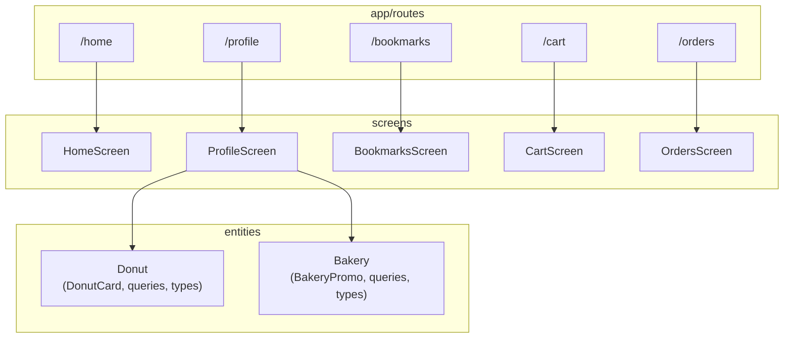

# Architecture Diagram

Functional structure of the application. Shows screens, entities, and cross-domain interactions.
Use this to answer: "Where does new code belong?" and "How do major parts interact?"

